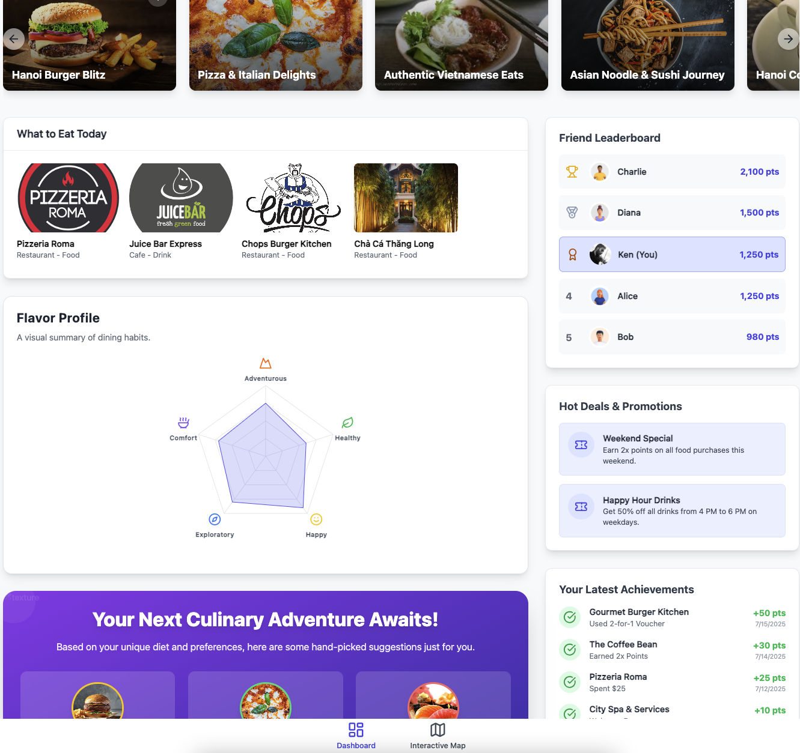
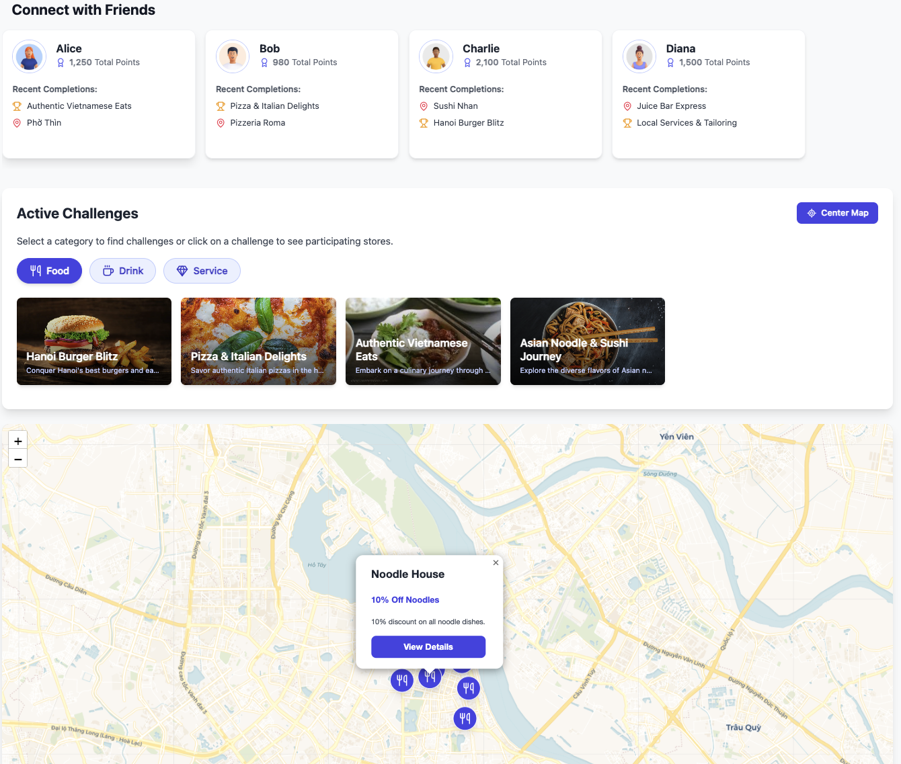

# Challenge Club ✨


[](https://opensource.org/licenses/MIT)

A gamified web application that transforms everyday explorations into exciting challenges and rewarding experiences. Compete with friends, discover local gems, and unlock exclusive benefits!

## 🚀 Project Overview

Challenge Club is an innovative web application designed to inject fun and competition into discovering local points of interest (POIs) like restaurants, cafes, and services. Our platform allows users to:

*   **Select Engaging Challenges:** Choose from a variety of challenges tailored to exploring different POIs.
*   **Compete & Connect:** Challenge friends, track progress, and climb leaderboards together, fostering a vibrant social experience.
*   **Earn Tangible Rewards:** Level up and gain access to exclusive vouchers and benefits from participating businesses.
*   **Explore with Ease:** Utilize an interactive map to find nearby POIs, available challenges, and connect with your community.
*   **Personalized Insights:** Receive smart suggestions and analytical insights based on your unique activity history, guiding you to new adventures.

Our goal is to encourage real-world exploration and engagement by making it a rewarding, social, and personalized journey.

## ✨ Features

*   **🏆 Gamified Challenges:** Engage in diverse challenges across various POI categories.
*   **🤝 Social Competition:** Add and find friends to compete, share achievements, and foster healthy rivalry.
*   **🎁 Exclusive Rewards:** Unlock vouchers, discounts, and special benefits from local businesses upon challenge completion and leveling up.
*   **🗺️ Interactive Map Integration:** Visually discover nearby points of interest and available challenges.
*   **👤 Personalized Recommendations:** AI-driven suggestions and insights based on your past activities and preferences.
*   **📈 Progress & Leveling System:** Track your journey, earn experience, and level up to unlock greater rewards and status.

## 🖼️ Screenshots / Demo
 

## 🛠️ Tech Stack

*   **TypeScript:** For robust and scalable code with static type checking.
*   **Vite:** A lightning-fast build tool that provides an incredibly quick development experience.
*   **React:** A declarative, efficient, and flexible JavaScript library for building dynamic user interfaces.
*   **Tailwind CSS:** A highly customizable, utility-first CSS framework for rapidly building bespoke designs.

## ⚙️ How to Run Locally

Follow these steps to get Challenge Club up and running on your local machine.

### Prerequisites

Ensure you have the following installed:

*   Node.js (LTS version recommended)
*   npm (comes with Node.js) or Yarn

### Installation

1.  **Clone the repository:**

    ```bash
    git clone https://github.com/thubpham/map_game_tcb.git
    cd map_game_tcb
    ```
2.  **Install dependencies:**

    ```bash
    npm install
    ```
3.  **Start the development server:**

    ```bash
    npm run dev
    ```
4.  **Open the app in your browser:**

    Visit `http://localhost:5173` (or the address provided in your console by Vite).

### Small note using code2prompt for easier vibe coding
` code2prompt . --include="src/" --exclude="src/prompt.md" --output-file=prompt/my_prompt.txt `

## 💡 Roadmap

Our vision for Challenge Club is continuously evolving. Here are some key improvements and features we plan to implement:

### Core Functionality
*   [ ] **Enhanced Challenge System:**
    *   [ ] Implement more diverse challenge types (e.g., time-based, location-specific, multi-POI sequences).
    *   [ ] Develop user-generated challenge creation tools.
*   [ ] **Advanced Recommendation Engine:**
    *   [ ] Integrate more sophisticated algorithms for highly personalized suggestions.
    *   [ ] Explore integration with external data sources for richer insights (e.g., public event APIs).

### Location & Map Features
*   [ ] **Proximity-based Challenges:** Display challenges closest in proximity to the user's current location.
*   [ ] **POI Information Cards:** Implement interactive information cards for points of interest displaying details, challenges, and user reviews.
*   [ ] **Friend Activity on Map:**
    *   [ ] Show friends' visited locations pop up on the map.
    *   [ ] Introduce "friends' bubbles" on the map with integrated stories/short updates of their activities.

### Social & Community
*   [ ] **Improved Social Features:**
    *   [ ] Implement in-app messaging for direct communication between friends.
    *   [ ] Introduce group challenges and team-based competitions.
    *   [ ] Develop a robust friend suggestion system.
    *   [ ] Enhance friend profile/extended cards with more detailed activity and achievement views.

### Gamification & UX
*   [ ] **Gamification Enhancements:**
    *   [ ] Introduce a comprehensive system for badges, achievements, and unlockable cosmetic items.
    *   [ ] Refine leaderboards with global, local, and friend-based rankings.
*   [ ] **User Experience Refinements:**
    *   [ ] Optimize map performance and add more interactive elements.
    *   [ ] Improve onboarding flow for new users.

### Future Platforms
*   [ ] **Mobile App Development:**
    *   [ ] Native iOS and Android applications for a seamless mobile experience.

## 🤝 Contributing

We welcome contributions from the community!

## 📜 License

Distributed under the MIT License. See `LICENSE` for more information.

## 📧 Contact

Thu Pham Bao - [thupham@example.com](mailto:your-email@example.com)

Project Link: [https://github.com/thubpham/map_game_tcb](https://github.com/thubpham/map_game_tcb)